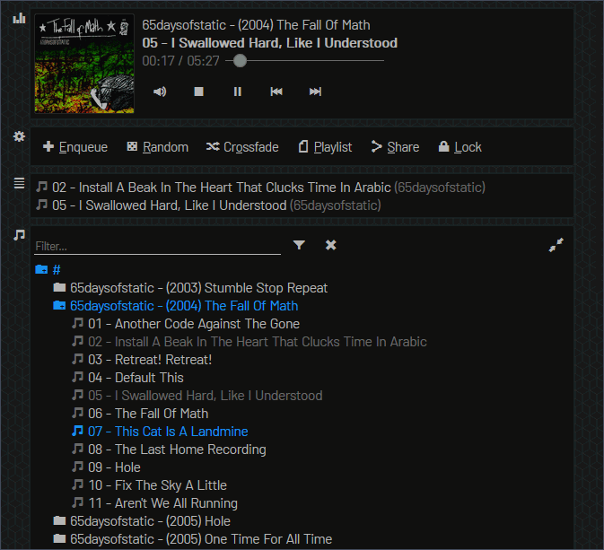

   

# Music Folder Player (MFP)

An elegant HTML5 web folder player for parties and/or private music collections, with a playlist system that all players should have had. It does not use a database (so it's alway up-to-date), but can easily handle folders with 25,000 songs or more. It has no dependencies other than PHP and installation costs less than 2 minutes. The design should be fully responsive on CSS3-compatible browsers.

Optionally, individual files and/or playlists can be sent to a streaming server instead for playback (locally or remotely), thus allowing MFP to act as a very simple broadcast manager.

## Overview

#### Player

-   Rebuilds the tree of a specified folder, showing only files with supported extensions
-   Click on cover image to zoom (300x300px, again for full size)
-   Click on current song or folder name to find it in the library

#### Playlist

-   Drag and drop to change the playlist order or drag to bin to remove
-   Random playback will prevent choosing already played songs (unless "Play next" is used)
-   Click on a song to play directly
-   Right-click (long-press) a song to find it in the library
-   Choose how to continue when the playlist is exhausted:
    -   Stop playback
    -   Repeat the playlist
    -   Continue from last song's position in library
    -   Randomly select unplayed songs from the (filtered) library
-   Playlist and configuration will be saved to the browser's Local Storage if possible
-   Load/save online playlists (optional)
-   Import/export playlists from/to a local file

#### Library

-   Sports a library filter to quickly find songs
-   Click a song to play (or enqueue when "Enqueue" mode is enabled)
-   Clicking on a song will always keep the playlist intact
-   Right-click (long-press) a song to play it next
-   Right-click (long-press) a folder to add all its songs to the playlist
-   Use arrow keys to traverse the library tree, Enter to play/enqueue, or Shift-Enter to play next/add folder

#### Parties

-   Password lock the playlist and playlist controls (allowing only Enqueue, Play next, Play/pause and Share)
-   Tip: use [OpenKiosk](http://openkiosk.mozdevgroup.com) and disable _Set inactive terminal_
-   Prevents adding a song if it's already queued up
-   Do not add previously played songs to playlist (optional)

#### Sharing

-   Download a song or zipped folder
-   Share a song, folder or playlist link (library features/options will be hidden)
-   Share links directly to WhatsApp (optional)

#### Streaming

-   New: streaming mode! (optional)
-   Instead of downloading files for playback on the client's browser, send them to a streaming server
-   Client app will contact the streaming server and play from it (thus validating that it's working)

## List of hotkeys

A list of all the hotkeys can be found in the [Wiki](https://github.com/ltGuillaume/MusicFolderPlayer/wiki/List-of-hotkeys).

## Installation

You can have a test setup running within 2 minutes. For all the details, check the [Wiki](https://github.com/ltGuillaume/MusicFolderPlayer/wiki).

## Optional instructions for sending to a streaming server

MFP can act as a simplified broadcast manager by simply adding a few extra options on `music.ini` to send files to a streaming server, as opposed to playing them via download (the default).

-   Create a new `[streamer]` section on `music.ini`. Do _not_ touch `music.defaults.ini`! Use it for inspiration only
-   Set `push_to_streamer` to `true`
-   Add the streaming server URL on `streamer_url`. This is supposed to be the address that your streaming server accepts for _receiving_ (origin) streams and might require logins/passwords/keys on the URL to authenticate your request.
-   Select the streaming protocol used and put it on `streaming_protocol`. Note that this is a convenient way for generating the `ffmpeg` command line; your own command line might not require this parameter.
-   Finally, add the (local) command to send file to streaming server on `streamer_command` (default is a locally installed `ffmpeg`). A few variables are possible:

    -   `%filename%`: current filename, as produced by MFP
    -   `%streaming_protocol%`: set to the value of `streaming_protocol` defined above
    -   `%streamer_url%`: simalrly, this is set to the value of `streamer_url`

        In the future, other variables might get replaced as well.

## Credits

-   Some concepts of this project are based on the excellent [HTML5 Music Player](https://github.com/GM-Script-Writer-62850/HTML5-Music-Player) by [GM-Script-Writer-62850](https://github.com/GM-Script-Writer-62850)
-   The [Barlow font](https://github.com/jpt/barlow) (Regular and Semi Condensed Regular) is used for text
-   The [Foundation icon font](https://zurb.com/playground/foundation-icon-fonts-3) is used for all icons
-   Album art placeholder is based on a [design by CmdRobot](http://fav.me/d7kpm65)

All credits are due, as well as my sincere thanks!
